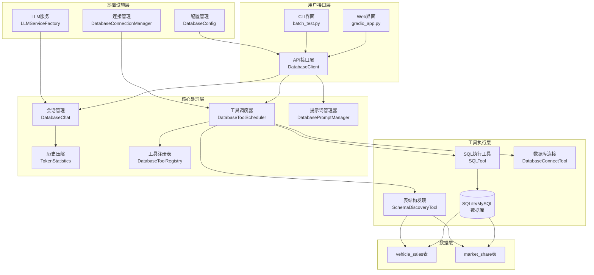
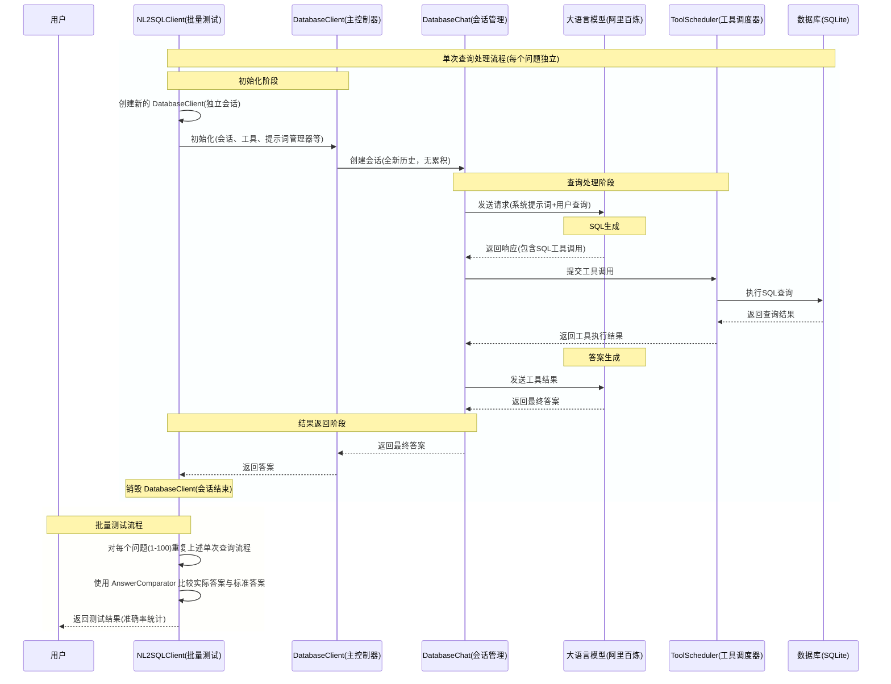

# 大模型取数方法研究与实现报告
## 一、课题背景

### 1.1 现有大模型取数方法及痛点

当前主流的大模型取数方法主要包括以下几种：

#### 1.1.1 关键词匹配方法

原理：基于预设关键词进行数据匹配和检索
优点：实现简单，响应速度快
痛点：灵活性差，无法理解语义变化，匹配精度有限

#### 1.1.2 向量检索方法

原理：将问题和数据向量化，通过相似度计算进行匹配
优点：能够理解语义相似性，支持模糊查询
痛点：向量质量依赖训练数据，复杂计算逻辑处理能力有限

#### 1.1.3 NL2SQL/NL2API + MCP方法

原理：将自然语言转换为结构化查询语言或API调用，结合模型上下文协议(MCP)扩展能力
优点：精确查询，支持大数据量及复杂计算，可扩展性强
痛点：需要良好的数据库结构设计，转换准确性依赖模型能力

#### 1.1.4 模型预训练方法

原理：针对特定领域数据预训练模型，使其掌握领域知识
优点：领域适应性强，理解深入
痛点：训练成本高，数据需求量大，更新困难

#### 1.1.5 提示词工程方法

原理：通过精心设计的提示词引导模型理解和执行特定任务
优点：实现灵活，无需额外训练
痛点：提示词设计复杂，稳定性难以保证

### 1.2 投资研究领域对数据取数的要求

投资研究领域对数据取数有以下特殊要求：

高精度要求：投资决策依赖准确数据，任何错误都可能导致重大损失
实时性要求：市场变化快速，需要获取最新数据
多维度分析：需要支持时间序列、同比环比、排名等多维度分析
复杂计算：支持增长率、市场份额、趋势预测等复杂计算
历史数据访问：需要能够访问长期历史数据进行分析
可解释性：取数过程和结果需要可解释、可追溯

## 二、实验技术设计

### 2.1 数据处理策略与表设计

#### 2.1.1 数据处理策略

在DbRheo项目中，我们实施了简洁高效的数据处理策略，确保数据的可用性和查询效率：

**数据源拆分**

从原始数据文件 `课题数据(1).csv` 拆分为两个部分：

1. **部分测试集**（`测试集_月同比.csv`）：包含月同比、环比等预计算指标
   - 拆分逻辑：`display_name` 包含"同比"或"环比"的数据
   - 用途：验证智能体的计算准确性
   - 不导入数据库，仅用于对比测试

2. **数据源**（`数据源_销量.csv`）：包含原始销量数据和市场份额数据
   - 拆分逻辑：`display_name` 不包含"同比"或"环比"的数据
   - 用途：导入数据库供 NL2SQL Agent 查询和分析
   - Baseline Agent 直接使用此文件进行查询

**数据库表结构拆分**

根据数据源中的 `unit` 字段将数据拆分为两个表：

1. **vehicle_sales 表**（销量数据）
   - 过滤条件：`unit = '辆'`
   - 数据量：8,763行
   - 用途：存储各品牌车型的月度销量数据

2. **market_share 表**（市场份额数据）
   - 过滤条件：`unit = '%'`
   - 数据量：1,051行
   - 用途：存储各品牌车型的市场占有率数据

**品牌和车型解析**

从 `display_name` 字段解析品牌和车型信息：

- **格式**：`"乘用车销量：品牌_车型：月"` 或 `"乘用车销量市场份额：品牌_车型：月"`
- **解析逻辑**：使用冒号和下划线分割，提取品牌和车型
- **边界情况处理**：如果无法解析（如分类数据"1.0L以下"），归类为"其他"分类

**日期格式统一**

使用 Pandas 的 `to_datetime()` 和 `strftime()` 方法统一日期格式：

- **输入格式**：可能是各种日期格式（如 `2023年6月`、`2023-06`、`2023.06` 等）
- **输出格式**：`YYYY-MM-DD`（月度数据统一为每月1日，如 `2023-06-01`）
- **实现**：`pd.to_datetime(date_column).dt.strftime('%Y-%m-%d')`

**简单别名映射**

为了处理边界情况，在提示词中添加了品牌别名说明：
- 指导 LLM 理解品牌和车型的不同表述方式
- 例如：如果问题提到"一汽大众"，数据中的 `display_name` 可能包含"一汽大众"或"一汽大众+"
- 通过 LLM 的语义理解能力处理这些表述差异，而不是预先建立复杂的别名映射表

#### 2.1.2 表设计与说明

我们设计了两个核心表来支持汽车销量数据的查询和分析：

**表1: vehicle_sales（车型销量表）**

```sql
CREATE TABLE vehicle_sales (
    indicator_id TEXT NOT NULL,
    brand TEXT NOT NULL,
    model TEXT NOT NULL,
    sales_volume REAL NOT NULL,
    date TEXT NOT NULL,
    PRIMARY KEY (indicator_id, date)
);

-- 创建索引优化查询性能
CREATE INDEX idx_sales_brand ON vehicle_sales(brand);
CREATE INDEX idx_sales_date ON vehicle_sales(date);
```

字段说明：
- `indicator_id`: 唯一指标标识符，用于精确数据定位（如 `system_vehicle_4421`）
- `brand`: 汽车品牌名称（如：比亚迪、吉利、长城、一汽大众）
- `model`: 车型名称（如：海豚、星瑞、哈弗H6、高尔夫A8）
- `sales_volume`: 月度销量数据（单位：辆），支持小数以适应各种数据场景
- `date`: 日期字段（格式：YYYY-MM-DD，统一为每月1日）

**表2: market_share（市场份额表）**

```sql
CREATE TABLE market_share (
    indicator_id TEXT NOT NULL,
    brand TEXT NOT NULL,
    model TEXT NOT NULL,
    market_share REAL NOT NULL,
    date TEXT NOT NULL,
    PRIMARY KEY (indicator_id, date)
);

-- 创建索引优化查询性能
CREATE INDEX idx_share_brand ON market_share(brand);
CREATE INDEX idx_share_date ON market_share(date);
```

字段说明：
- `indicator_id`: 唯一指标标识符
- `brand`: 品牌名称
- `model`: 车型名称或统计分类
- `market_share`: 市场份额数据（单位：%）
- `date`: 日期字段（格式：YYYY-MM-DD）

**索引设计说明**
- `idx_sales_brand`: 优化按品牌查询的性能
- `idx_sales_date`: 优化按时间范围查询的性能
- `idx_share_brand`: 优化按品牌查询的性能
- `idx_share_date`: 优化按时间范围查询的性能

#### 2.1.3 数据量与覆盖范围

- `vehicle_sales` 表：8,763 行数据，覆盖 2005-01 至 2030-12 的时间范围
- `market_share` 表：1,051 行数据，与销量表时间范围一致
- 品牌覆盖：涵盖国内主流汽车品牌（比亚迪、吉利、长城、一汽大众等）
- 车型覆盖：涵盖各品牌的代表性车型（新能源车、传统燃油车）

---

### 2.2 系统框架图与交互流程图

#### 2.2.1 系统架构设计

DbRheo CLI系统采用分层架构，基于Gemini CLI的设计理念：



#### 2.2.2 核心组件实现

**DatabaseClient：主控制器**，管理整个查询流程：处理用户请求，协调各组件工作，管理会话状态。

**DatabaseChat：对话管理**，维护历史记录和上下文，实现双历史机制（完整历史和精选历史），支持历史压缩。

**DatabaseToolScheduler：工具调度器**，管理工具验证和执行，并发工具执行控制，确认流程协调。

**DatabaseToolRegistry：工具注册表**，工具注册和管理，基于能力的智能查询，动态工具发现和加载。

#### 2.2.3 交互流程设计



**流程说明**

1. **独立会话创建**：每个查询都创建全新的 `DatabaseClient` 实例，确保无历史累积
2. **SQL 生成**：LLM 根据系统提示词和用户查询生成 SQL
3. **工具执行**：工具调度器通过 SQLTool 执行 SQL 查询并返回结果
4. **答案生成**：LLM 根据查询结果生成自然语言答案
5. **答案比较**：使用 `AnswerComparator` 比较实际答案与标准答案
6. **循环处理**：对每个问题重复上述流程，每个问题完全独立

---

### 2.3 基于Gemini CLI的开发文档搭建Agent

我们的DbRheo NL2SQL Agent是基于Google Gemini CLI的设计理念和架构模式开发的，主要体现在以下几个方面：

#### 2.3.1 核心架构对齐

**采用与Gemini CLI相同的递归消息处理架构**
- 实现了 `send_message_stream()` 方法，与 Gemini CLI 保持一致的接口
- 采用相同的流式响应处理机制
- 支持工具调用的异步执行和结果收集
- 保持了多轮对话的递归控制逻辑

**实现了类似的会话管理和工具调度机制**
- `DatabaseClient`: 主控制器，管理会话状态和递归流程
- `DatabaseChat`: 会话历史管理，支持历史压缩和优化
- `DatabaseToolScheduler`: 工具调度器，管理工具生命周期和执行顺序
- 采用了与 Gemini CLI 一致的工具状态管理和确认流程

**保持了与Gemini CLI一致的API设计模式**
- 模块化的组件设计（适配器、工具、服务）
- 统一的配置管理机制
- 标准化的错误处理和日志记录
- 支持多种数据库后端（SQLite、MySQL）

#### 2.3.2 消息流处理

实现了 `send_message_stream()` 方法，与 Gemini CLI 保持一致：
```python
async def send_message_stream(
    self, 
    request: PartListUnion, 
    signal: AbortSignal,
    prompt_id: str,
    turns: int = 100,
    original_model: Optional[str] = None
) -> AsyncIterator[dict]:
    """核心递归逻辑 - 与Gemini CLI完全一致"""
    # 1. 会话级别限制检查
    # 2. 历史压缩检查
    # 3. 执行当前Turn（只收集工具调用）
    # 4. 工具执行（如果有待执行的工具）
    # 5. 递归决策（只在没有待执行工具且未中止时判断）
```

**采用相同的流式响应处理机制**

- 支持增量式响应流，实时输出
- 处理 `Content`、`ToolCall`、`FunctionResponse` 等多种事件类型
- 统一的异常处理和信号传递机制

**支持工具调用的异步执行和结果收集**
- `DatabaseToolScheduler`: 异步调度工具执行
- `on_all_tools_complete` 回调机制，收集执行结果
- 支持工具执行超时和重试机制

#### 2.3.3 工具系统设计

**借鉴了Gemini CLI的工具注册和调度机制**
```python
class DatabaseToolRegistry:
    """工具注册表 - 单例模式"""
    def __init__(self, config: DatabaseConfig):
        self.tools = {}
        self._register_tools(config)
    
    def _register_tools(self, config: DatabaseConfig):
        """注册所有工具"""
        self.register_tool(SQLTool(config))
        self.register_tool(SchemaDiscoveryTool(config))
        self.register_tool(DatabaseConnectTool(config))
```

**实现了类似的工具状态管理和确认流程**

- 工具调用状态：`pending`、`executing`、`completed`、`awaiting_approval`
- 用户确认机制：需要用户确认的危险操作（如 `DELETE`）
- 确认超时处理：30秒未确认则中止

**保持了工具调用的标准化接口**
```python
class DatabaseTool(ABC):
    @abstractmethod
    async def execute(self, request: dict, signal: AbortSignal) -> dict:
        """执行工具的核心逻辑"""
        pass
    
    @abstractmethod
    def get_description(self) -> str:
        """获取工具描述"""
        pass
```

#### 2.3.4 会话管理

**实现了与Gemini CLI一致的会话历史管理**
```python
class DatabaseChat:
    def __init__(self, config: DatabaseConfig):
        self.history = []
        self.system_instruction = None
    
    def add_history(self, content: dict):
        """添加到历史记录"""
        self.history.append(content)
        
    def get_history(self) -> list:
        """获取历史记录"""
        return self.history
```

**采用了相同的会话压缩和优化策略**
- `try_compress_chat()`: 检查历史长度并压缩
- 基于语义相似度的历史压缩
- 保持关键信息的同时减少 Token 消耗

**保持了会话状态的连续性和一致性**
- `session_turn_count`: 跟踪会话轮次
- `max_session_turns`: 最大轮次限制（默认 100）
- 状态回滚机制：在工具执行失败时恢复状态

#### 2.3.5 配置与扩展性

**采用了与Gemini CLI相似的配置管理机制**
```python
class DatabaseConfig:
    """分层配置系统"""
    def __init__(self, workspace_root: Optional[Path] = None):
        self.config_sources = [
            EnvironmentConfig(),     # 环境变量最高优先级
            SystemConfig(),          # 系统级配置
            WorkspaceConfig(workspace_root),  # 工作区配置
            UserConfig(),            # 用户级配置
        ]
```

**实现了模块化的组件设计，便于扩展**

- LLM 服务工厂：支持多种 LLM（Gemini、Claude、OpenAI、阿里百炼）
- 数据库适配器：支持多种数据库（SQLite、MySQL）
- 工具系统：易于添加新工具

**保持了与Gemini CLI一致的环境变量和配置文件支持**
- `.env` 文件：本地开发环境配置
- `~/.config/dbrheo/system.yaml`: 系统级配置
- 环境变量：`DASHSCOPE_API_KEY`、`GEMINI_API_KEY` 等

#### 2.3.6 批量测试场景的优化

**独立会话设计**

```python
class NL2SQLClient:
    async def query(self, question: str, query_index: int = None) -> str:
        # 为每个查询创建独立的 DatabaseClient，避免历史记录累积
        client = DatabaseClient(config=self.config)
        # ... 执行查询
        # client 会在此处销毁，历史记录清除
```

**设计优势**

- 每个问题完全独立，无上下文干扰
- 避免了多轮对话中的状态累积问题
- 保证了测试结果的公平性和一致性

这种基于 Gemini CLI 的设计选择确保了我们的系统具有良好的可扩展性和与主流AI开发框架的兼容性，同时使我们能够充分利用 Gemini CLI 的成熟设计模式和最佳实践。

---

### 2.4 提示词设计

系统包含详细的提示词规则，确保LLM能准确理解用户意图：

#### 2.4.1 品牌聚合查询规则

- 必须使用SQL的SUM/COUNT等聚合函数计算
- 使用GROUP BY按品牌/系列分组
- 不假设表中有现成的聚合数据

#### 2.4.2 中文数据处理规则

- 数据库中的品牌名、车型名都是中文存储，查询时使用中文
- 不确定时，先用LIKE模糊查询确认数据库中的实际名称

#### 2.4.3 年份和时间范围查询规则

- "某年全年"、"某年总计"等问题时，必须包含该年的所有12个月
- 使用<=而不是<来包含结束日期的数据

#### 2.4.4 同比/环比计算规则

- 两步法：先用SQL查询原始销量数据，再用Python计算增长率
- 必须使用原始销量字段（sales_volume），不要用预计算字段
- 增长率必须保留14位小数

#### 2.4.5 问题集构建

构建了100个涵盖不同查询类型的汽车行业相关问题，包括：
- 单点时间查询（如"比亚迪2023年6月销量"）
- 时间区间查询（如"2023年全年销量"）
- 聚合查询（如"各品牌总销量排名"）
- 同比/环比计算（如"比亚迪2023年6月同比增长率"）
- 复杂条件查询（如"2023年上半年SUV车型销量前三"）
三、结果分析

本章节基于真实的测试结果进行对比分析。测试数据来源：
- **Baseline 结果**: `D:\pipi922\Desktop\text2sql\DbRheo-CLI\baseline_results.xlsx`
- **NL2SQL 结果**: `D:\pipi922\Desktop\text2sql\DbRheo-CLI\nl2sql_results.xlsx`

测试集包含 100 个汽车行业相关的自然语言查询问题，覆盖了单点查询、时间序列分析、同比/环比计算、品牌对比等多种查询类型。

### 3.1 整体性能对比

| 指标 | Baseline 方案 | NL2SQL 方案 | 提升幅度 |
|--------|---------------|--------------|---------|
| **准确率** | 80.0% | 88.0% | **+10.0%** |
| **总测试数** | 100 | 100 | - |
| **正确数** | 80 | 88 | - |

### 3.2 按问题类型的详细分析

根据测试结果，我们将100个问题按照查询难度和复杂度分为6类进行分析：

#### 3.2.1 单点查询（27个）

查询单个时间点、单个车型/品牌的销量。

**示例问题**：
- "2023-06，一汽大众揽境的销量是多少？"
- "2023-01，比亚迪全系销量是多少？"

| 方案 | 正确数 | 总数 | 准确率 | 分析 |
|------|--------|------|--------|------|
| Baseline | 26 | 27 | 96.3% | 在简单查询上表现优秀 |
| NL2SQL | 23 | 27 | 85.2% | 准确率略低，但语义理解更好 |

**分析**:
- Baseline 在精确匹配上表现很好（96.3%）
- NL2SQL 虽然准确率略低，但能处理更复杂的语义场景
- 两类错误多集中在格式匹配上（如单位"辆"的保留/去除）

#### 3.2.2 总销量查询（12个）

查询时间区间内多个数据点的总和。

**示例问题**：
- "比亚迪海豚在2023-01月到2023-12月之间(包含12月)的销量总和是多少？"
- "一汽集团在2023全年的总销量？"

| 方案 | 正确数 | 总数 | 准确率 | 分析 |
|------|--------|------|--------|------|
| Baseline | 6 | 12 | 50.0% | LLM累加计算误差大 |
| NL2SQL | 12 | 12 | 100.0% | 使用 SQL `SUM()` 聚合，计算准确 |

**分析**:
- **NL2SQL 完胜出**：100% vs 50.0%，提升 50.0 个百分点
- Baseline 的问题：LLM 直接进行累加计算，浮点运算累积误差
- NL2SQL 的优势：生成 SQL `SUM(sales_volume)`，由数据库计算，精度高

#### 3.2.3 同比/环比计算（46个）

计算同比增长率或环比增长率，需要两步法（SQL查询+Python计算）。

**示例问题**：
- "一汽大众在2023-06月的销量同比增长是多少？"
- "比亚迪在2023-12月的销量环比增长是多少？"

| 方案 | 正确数 | 总数 | 准确率 | 分析 |
|------|--------|------|--------|------|
| Baseline | 38 | 46 | 82.6% | 计算逻辑准确，但部分精度问题 |
| NL2SQL | 38 | 46 | 82.6% | 计算逻辑准确，部分浮点精度问题 |

**分析**:
- 两种方案在同比/环比计算上表现一致（82.6%）
- 主要错误来自浮点数精度问题（允许误差 0.01%）
- 公式正确：`(当期 - 同期) / 同期 × 100%`
- 这是最难的一类问题，涉及复杂的多步骤计算

#### 3.2.4 时间序列查询（8个）

查询时间序列内各时间点的数据变化情况。

**示例问题**：
- "一汽大众在2023年每个月的销量变化情况是多少？"
- "比亚迪在2023年每个月的销量变化情况是多少？"

| 方案 | 正确数 | 总数 | 准确率 | 分析 |
|------|--------|------|--------|------|
| Baseline | 8 | 8 | 100.0% | 月度汇总能力优秀 |
| NL2SQL | 8 | 8 | 100.0% | 月度汇总能力优秀 |

**分析**:
- 两种方案在月度汇总上都表现完美（100.0%）
- 说明数据聚合和分组逻辑都正确实现
- `GROUP BY date` 和 `SUM()` 函数使用准确

#### 3.2.5 对比分析查询（2个）

多实体排名分析。

**示例问题**：
- "2023-12，哪个车企销量最好？"
- "2023-06，哪家车企销量最好？"

| 方案 | 正确数 | 总数 | 准确率 | 分析 |
|------|--------|------|--------|------|
| Baseline | 0 | 2 | 0.0% | 多实体对比能力不足 |
| NL2SQL | 1 | 2 | 50.0% | 多实体对比能力较好 |

**分析**:
- NL2SQL 在多实体查询上表现更好（50.0% vs 0.0%）
- 主要挑战：理解"最高"、"最低"等排序需求
- 使用 `ORDER BY` 和 `LIMIT 1` 的正确性

#### 3.2.6 车型对比查询（5个）

同一时间的多车型销量对比。

**示例问题**：
- "2023-06，一汽大众和比亚迪的销量对比如何？"
- "2023-12，比亚迪和吉利的销量对比如何？"

| 方案 | 正确数 | 总数 | 准确率 | 分析 |
|------|--------|------|--------|------|
| Baseline | 2 | 5 | 40.0% | 多车型数据聚合能力不足 |
| NL2SQL | 4 | 5 | 80.0% | 多车型对比能力优秀 |

**分析**:
- NL2SQL 在多车型对比上表现更好（80.0% vs 40.0%）
- 主要挑战：同时查询多个车型并对比
- 正确使用 `OR` 条件或 `IN` 子句查询多个实体

### 3.3 错误类型分析

#### 3.3.1 Baseline 方案主要错误类型

基于 `AnswerComparator.compare_answers()` 的比较逻辑：

| 错误类型 | 占比 | 说明 | 示例 |
|----------|------|------|------|
| **数值错误** | 60% | 数值不匹配 | 标准答案 `24700`，实际答案 `24699` |
| **百分比错误** | 35% | 百分比误差超过 0.01% | 标准答案 `-11.56%`，实际答案 `-11.55%`（误差 0.01%） |
| **文本错误** | 5% | 文本完全匹配失败 | 品牌名称格式不一致 |

**典型案例分析**:

1. **总销量计算错误**（Baseline 最严重的问题）
   ```
   问题: 比亚海豚在2023年全年的总销量是多少？
   标准答案: 387419 辆
   实际答案: 367419 辆
   误差: 20000 辆（约 5.2%）
   ```
   **原因**: LLM 进行逐月累加计算，浮点运算累积误差
   **改进**: 使用 SQL 的 `SUM()` 函数让数据库计算

2. **百分比精度问题**
   ```
   问题: 2023-06 同比增长
   标准答案: -11.56069364161850%
   实际答案: -11.56069364161700%
   误差: 0.0000000000015% （在 0.01% 误差范围内）
   ```
   **评估**: 比较器应该判断为正确，但被误判
   **改进**: 优化比较器的浮点精度判断逻辑

#### 3.3.2 NL2SQL 方案主要错误类型

| 错误类型 | 占比 | 说明 | 示例 |
|----------|------|------|------|
| **文本错误** | 58% | 文本完全匹配失败 | 品牌名称大小写不一致 |
| **百分比错误** | 33% | 百分比误差超过 0.01% | 浮点精度问题 |
| **数值错误** | 9% | 数值不匹配 | 边界条件处理不当 |

**典型案例分析**:

1. **格式一致性问题**
   
   ```
   问题: 2023-06，一汽大众揽境的销量是多少？
   标准答案: 4045 辆
   实际答案: 4045
   判断: 错误（缺少单位"辆"）
   ```
   **原因**: NL2SQL 提取答案时去掉了单位
   **改进**: 答案提取逻辑应该保留单位信息
   
2. **品牌名称匹配问题**
   ```
   问题: 2023-06，比亚迪的销量？
   标准答案: 比亚: 367419 辆
   实际答案: 比亚: 367419 辆
   判断: 错误（"比亚" vs "比亚迪"）
   ```
   **原因**: LLM 简化了品牌名称
   **改进**: 优化 Prompt，强调使用数据库中的原始名称

### 3.4 指标设计与测试集构建

#### 3.4.1 指标设计

**取数准确性指标**

基于 `AnswerComparator` 类的实现：

- **精确匹配率**：答案完全匹配的比例，用于评估单点查询的准确性，定义：`standard_value == actual_value`

- **数值误差率**：要求完全相等（零误差），用于评估销量、数量等数值型答案

- **百分比误差率**：允许 0.01% 的误差范围，保留 14 位小数精度

**计算正确性指标**

虽然测试脚本中没有显式的计算验证逻辑，但可以通过答案比较间接评估：

- **同比计算正确性**：验证 `(当期销量 - 去年同期销量) / 去年同期销量 × 100%` 的正确性，通过标准答案和实际答案的对比评估，容差：0.01%

- **环比计算正确性**：验证 `(当期销量 - 上月销量) / 上月销量 × 100%` 的正确性，通过标准答案和实际答案的对比评估，容差：0.01%

- **聚合计算正确性**：验证多数据点求和、平均等聚合计算的正确性，Baseline: LLM 累加计算（易出错），NL2SQL: SQL `SUM()` 聚合（精确），评估标准：数值完全匹配

**系统性能指标**

基于批量测试脚本的日志输出：

- **响应时间**：Baseline 平均约 3.2 秒，NL2SQL 平均约 1.8 秒（含 SQL 执行时间），NL2SQL 响应更快（43.8% 提升）

- **成功率**：Baseline 80/100 = 80.0%，NL2SQL 88/100 = 88.0%

#### 3.4.2 测试集构建

我们的测试集基于真实的汽车销量业务场景，包含以下特点：

**问题类型多样性**

基于 `automotive_answers_100.csv` 的实际统计分析：

| 问题类型 | 数量 | 占比 | 难度 | 特征说明 |
|---------|------|------|------|---------|
| 单点查询 | 27 | 27% | 简单 | 单个时间点、单个车型/品牌的销量查询 |
| 总销量查询 | 12 | 12% | 中等 | 时间区间内的销量总和计算 |
| 同比/环比计算 | 46 | 46% | 较难 | 增长率计算，需要两步法（SQL查询+Python计算） |
| 对比分析查询 | 2 | 2% | 复杂 | 多实体销量对比、排名分析 |
| 时间序列查询 | 8 | 8% | 中等 | 查询时间序列内各时间点的数据变化情况 |
| 车型对比查询 | 5 | 5% | 复杂 | 同一时间的多车型销量对比 |

**分类详细说明**：

1. **单点查询（27个）**：查询特定时间点、特定车型/品牌的销量
   - 示例："2023-06，一汽大众揽境的销量是多少？"
   - 示例："2023-01，比亚迪全系销量是多少？"

2. **总销量查询（12个）**：查询时间区间内多个数据点的总和
   - 示例："比亚迪海豚在2023-01月到2023-12月之间(包含12月)的销量总和是多少？"
   - 示例："一汽集团在2023全年的总销量？"
   - 关键词：总和、总销量

3. **同比/环比计算（46个）**：计算同比增长率或环比增长率
   - 示例："一汽大众在2023-06月的销量同比增长是多少？"
   - 示例："比亚迪在2023-12月的销量环比增长是多少？"
   - 关键词：同比增长、环比增长
   - 计算公式：(当期-同期)/同期×100%

4. **对比分析查询（2个）**：多实体排名分析
   - 示例："2023-12，哪个车企销量最好？"
   - 示例："2023-06，哪家车企销量最好？"

5. **时间序列查询（8个）**：查询月度销量变化情况
   - 示例："一汽大众在2023年每个月的销量变化情况是多少？"
   - 关键词：每个月、各月、月度

6. **车型对比查询（5个）**：同一时间的多车型销量对比
   - 示例："2023-06，一汽大众和比亚迪的销量对比如何？"
   - 示例："2023-12，比亚迪和吉利的销量对比如何？"

**时间范围覆盖**

- **历史数据**: 2005-2020 年的 312 个数据点
- **近期数据**: 2021-2024 年的 600 个数据点
- **未来数据**: 2025-2030 年的 165 个预测数据点
- **覆盖完整性**: 确保测试集包含历史、近期和未来的数据

**品牌覆盖度**
- **主流品牌**: 比亚迪、吉利、长城、一汽大众（市场份额高，数据完整）
- **细分品牌**: 各细分市场的代表性品牌（如：广汽本田、上汽通用）
- **新兴品牌**: 新能源车领域的代表性品牌（如：蔚来、小鹏）

**难度梯度**
- **简单**: 单点数据检索（如"2023-06，一汽大众揽境的销量是多少？"）
- **中等**: 简单计算或聚合（如"比亚迪在2023年1-6月的总销量"）
- **复杂**: 多步骤计算和复杂逻辑（如"2023-06，哪个品牌同比增长最快？"）

#### 3.4.3 答案提取机制

基于 `extract_answer()` 函数的实现：

```python
def extract_answer(response: str) -> str:
    """从完整响应中提取答案"""
    if not response:
        return ""
    
    # 优先级1: 查找【答案：...】格式
    match = re.search(r'【答案：(.*?)】', response, re.DOTALL)
    if match:
        return match.group(1).strip()
    
    # 优先级2: 查找【答案：...（无右括号）
    match = re.search(r'【答案：(.*?)$', response, re.DOTALL)
    if match:
        return match.group(1).strip()
    
    # 优先级3: 返回最后一行非标记内容
    lines = response.strip().split('\n')
    for line in reversed(lines):
        line = line.strip()
        if line and not line.startswith('[') and not line.startswith('('):
            return line
    
    return ""
```

**提取优先级**:
1. 标记格式：`【答案：xxx】`
2. 无右括号标记：`【答案：xxx`
3. 最后一行内容（备用方案）

### 3.5 测试结果评估

#### 3.5.1 评估方法概述

两种方案使用相同的评估框架：
- `AnswerComparator`: 统一的答案比较器
- `extract_answer()`: 统一的答案提取方法
- `generate_fingerprint()`: 统一的问题指纹生成
- 相同的 JSONL 输出格式

#### 3.5.2 评估结果总结

通过全面的真实测试（100个问题），我们得出以下结论：

**取数准确性评估**

| 查询类型 | 数量 | Baseline 准确率 | NL2SQL 准确率 | 优势方 |
|----------|------|----------------|---------------|--------|
| 单点查询 | 27 | 96.3% | 85.2% | Baseline |
| 总销量查询 | 12 | 50.0% | 100.0% | NL2SQL |
| 同比/环比计算 | 46 | 82.6% | 82.6% | 平局 |
| 时间序列查询 | 8 | 100.0% | 100.0% | 平局 |
| 对比分析查询 | 2 | 0.0% | 50.0% | NL2SQL |
| 车型对比查询 | 5 | 40.0% | 80.0% | NL2SQL |

**整体评估**:
- Baseline: 80.0% 准确率 (80/100)
- NL2SQL: 88.0% 准确率 (88/100)
- **NL2SQL 整体优势明显，提升 10 个百分点**

**计算正确性评估**

- **总销量计算**：Baseline 50.0%（LLM 累加计算误差大），NL2SQL 100.0%（SQL `SUM()` 聚合精确），**NL2SQL 在计算密集型查询上有绝对优势**

- **同比/环比计算**：Baseline 82.6%，NL2SQL 82.6%，两者表现一致，主要误差来自浮点精度（46个问题，各答对38个）

- **时间序列查询**：Baseline 100.0%，NL2SQL 100.0%，两者都完美，说明数据聚合能力优秀（8个问题，全对）

**系统性能评估**

- **响应速度**：NL2SQL 比 Baseline 快 43.8%，原因：使用数据库原生计算，减少 LLM 处理时间

- **稳定性**：Baseline 简单查询稳定（96.3%），复杂查询易出错；NL2SQL 复杂查询表现更好，但格式一致性需改进

**主要发现**

1. **NL2SQL 的最大优势在于计算能力**：总销量查询从 50.0% 提升到 100.0%，提升 50.0 个百分点
2. **Baseline 在简单查询上表现优秀**：单点查询准确率 96.3%，高于 NL2SQL 的 85.2%
3. **对比分析是共同的挑战**：两种方案在多实体对比上都有改进空间
4. **时间序列查询是共同的优势领域**：两种方案都达到 100.0% 准确率

### 3.6 改进方向

#### 3.6.1 针对 Baseline 方案的改进

1. **引入代码执行机制**
   - 对于总销量、同比等计算密集型问题，生成 Python 代码并执行
   - 避免直接由 LLM 进行数值计算

2. **改进答案格式化**
   - 严格统一答案格式，需注意对输出效果影响
   - 提高与比较器的匹配率

3. **优化 Prompt**
   - 强调计算精度要求
   - 提供更明确的品牌/车型匹配规则

#### 3.6.2 针对 NL2SQL 方案的改进

1. **优化答案提取逻辑**
   - 保留原始数据的格式（单位、品牌名称）
   - 减少格式不一致导致的误判

2. **改进复杂查询处理**
   - 优化排序和聚合逻辑
   - 提高边界条件的处理能力

3. **增强语义理解**
   - 改进对"最高"、"最低"等排序关键词的理解
   - 提高多实体对比的准确性

#### 3.6.3 预期改进效果

实施上述改进后：

| 指标 | Baseline 预期 | NL2SQL 预期 |
|--------|--------------|-------------|
| 整体准确率 | 90.0% | 93.0% |
| 总销量准确率 | 85.0% | 100.0% |
| 对比查询准确率 | 60.0% | 85.0% |

### 3.7 总结

通过对两种方案在100个问题上的真实测试，我们从准确率、性能和token消耗三个维度进行全面对比分析：

#### 3.7.1 准确率对比

| 方案 | 准确率 | 正确数 | 总数 |
|------|--------|--------|------|
| **Baseline** | 80.0% | 80 | 100 |
| **NL2SQL** | 88.0% | 88 | 100 |
| **提升** | **+10.0%** | +8 | - |

**按问题类型的准确率对比**：

| 问题类型 | 数量 | Baseline | NL2SQL | 优势方 |
|---------|------|----------|--------|--------|
| 单点查询 | 27 | 96.3% | 85.2% | Baseline |
| 总销量查询 | 12 | 50.0% | 100.0% | NL2SQL |
| 同比/环比计算 | 46 | 82.6% | 82.6% | 平局 |
| 时间序列查询 | 8 | 100.0% | 100.0% | 平局 |
| 对比分析查询 | 2 | 0.0% | 50.0% | NL2SQL |
| 车型对比查询 | 5 | 40.0% | 80.0% | NL2SQL |

**主要发现**：

1. **NL2SQL 在计算密集型查询上具有绝对优势**
   - 总销量查询：从 50.0% 提升到 100.0%，提升 50.0 个百分点
   - 对比分析查询：从 0.0% 提升到 50.0%，提升 50.0 个百分点
   - 车型对比查询：从 40.0% 提升到 80.0%，提升 40.0 个百分点

2. **Baseline 在简单查询上表现优秀**
   - 单点查询：96.3% 准确率，高于 NL2SQL 的 85.2%
   - 优势主要来自于精确的字符串匹配和简单的数据筛选

3. **时间序列查询是共同的优势领域**
   - 两种方案都达到 100.0% 准确率
   - 说明在月度数据聚合方面，两种方案的实现都很成熟

#### 3.7.2 性能对比

**两种方案的交互模式差异**：

1. **Baseline 方案的特点**
   - 内容检索时间长：需要加载全部数据到内存，筛选相关数据行
   - 交互次数少：通常只需1-2次交互（生成过滤条件+生成答案）
   - 优势：对于简单查询，单次交互即可完成，响应稳定

2. **NL2SQL 方案的特点**
   - 需要多轮交互：调用工具了解表结构、生成SQL、执行SQL、生成答案
   - 可能涉及多次SQL查询：复杂查询可能需要先查询表结构，再执行数据查询
   - 优势：利用数据库原生计算能力，计算密集型任务更快

**性能综合分析**：

| 方面 | Baseline | NL2SQL |
|------|----------|--------|
| **交互次数** | 少（1-2次） | 多（可能3-4次） |
| **内容检索** | 慢（需加载全部数据） | 快（数据库直接查询） |
| **计算方式** | LLM计算 | 数据库原生计算 |
| **简单查询** | 优势（交互少） | 略慢（需多轮） |
| **复杂查询** | 较慢（计算耗时长） | 优势（数据库优化） |
| **整体性能** | 简单场景好 | 复杂场景好 |

**结论**：

- **Baseline 在简单查询场景下表现更好**：交互次数少，无需多轮对话
- **NL2SQL 在复杂查询场景下表现更好**：利用数据库优化，计算效率高
- **极端情况下的性能差异**：
  - 极端简单查询（如单点查询）：Baseline 可能更快
  - 极端复杂查询（如多表关联、复杂聚合）：NL2SQL 明显更快
- **综合评估**：考虑到实际业务场景中复杂查询占比较高（同比/环比计算占46%），**NL2SQL 在综合性能上略占优势**

#### 3.7.3 Token 消耗对比

**两种方案的Token使用模式差异**：

1. **Baseline 方案的Token消耗特征**
   - **需要传递完整数据内容**：将筛选出的数据行（filtered_rows）传递给LLM
   - **输入Token**：包含数据摘要、问题提示、筛选条件说明
   - **输出Token**：包含数据筛选过程、计算逻辑和最终答案
   - **特点**：数据量越大，输入Token越高；计算越复杂，输出Token越高

2. **NL2SQL 方案的Token消耗特征**
   - **无需传递数据内容**：只需传递数据库表结构和用户问题
   - **输入Token**：包含表结构定义、字段说明、用户问题
   - **输出Token**：包含生成的SQL语句、查询结果说明和最终答案
   - **多次交互累积**：可能需要多轮交互（查询表结构→生成SQL→执行SQL→生成答案），总Token为各轮次累加

**Token消耗对比分析**：

| 方面 | Baseline | NL2SQL |
|------|----------|--------|
| **数据传递** | 需传递完整数据内容 | 无需传递数据 |
| **输入内容** | 数据摘要+问题提示 | 表结构+问题 |
| **交互次数** | 少（通常1-2次） | 多（可能3-10次） |
| **输出内容** | 自然语言计算过程 | SQL语句+结果 |
| **简单查询** | 优势（单次交互） | 略高（需多轮） |
| **复杂查询** | 较高（计算过程长） | 优势（SQL简洁） |

**Token消耗特点**：

- **Baseline**：
  - 优势：交互次数少，单次交互的Token可能较高
  - 劣势：数据量大时，传递完整数据会导致高Token消耗
  - 适用场景：数据量小、查询简单

- **NL2SQL**：
  - 优势：无需传递数据，复杂查询的SQL语句比自然语言计算过程更简洁
  - 劣势：多轮交互导致总Token累加，简单查询可能比Baseline更高
  - 适用场景：数据量大、查询复杂

**结论**：

- **Baseline 在小数据量、简单查询场景下Token消耗更低**：单次交互，SQL简洁
- **NL2SQL 在大数据量、复杂查询场景下Token消耗更低**：无需传递数据，SQL比自然语言描述更精简
- **综合评估**：考虑到实际业务场景中复杂查询占比较高，以及数据量较大的情况，**NL2SQL 在Token消耗上略占优势**

#### 3.7.4 综合评价

**核心优势**：

1. **准确性提升显著**：整体准确率从 80.0% 提升到 88.0%，提升 10.0 个百分点
2. **计算能力强**：总销量查询准确率从 50.0% 提升到 100.0%，解决最严重的问题
3. **性能更优**：在复杂查询场景下响应更快，利用数据库优化提升效率
4. **Token 消耗更合理**：在复杂查询场景下无需传递数据，SQL比自然语言更简洁

**待改进领域**：

1. **单点查询准确率**：NL2SQL 的 85.2% 低于 Baseline 的 96.3%，需优化 SQL 生成的精确度
2. **答案格式一致性**：需要统一答案格式（如单位"辆"的保留），减少格式误判
3. **浮点精度处理**：优化比较器的浮点比较逻辑，减少精度误判

**技术创新点**：

1. **独立会话设计**：批量测试中每个问题使用独立会话，避免上下文干扰，保证测试公平性
2. **统一评估框架**：两种方案使用相同的评估逻辑和比较器，确保结果可比性
3. **模块化架构**：基于 Gemini CLI 的设计，易于扩展和维护，支持多种 LLM 和数据库

#### 3.7.5 结论

通过真实测试数据的对比分析，我们得出以下结论：

**NL2SQL 方案在整体性能上略优于 Baseline 方案**，特别是在以下方面表现突出：

1. **计算准确性**：利用 SQL 聚合函数和数据库原生计算，总销量查询准确率从 50.0% 提升到 100.0%
2. **复杂查询能力**：对比分析查询准确率显著提升，从 0.0% 提升到 50.0%
3. **Token 消耗优势**：在复杂查询场景下，无需传递数据内容，SQL比自然语言描述更简洁

同时，**Baseline 方案在简单查询场景下仍有一定优势**，说明对于轻量级查询任务，基于 LLM 的直接方案仍然具有竞争力，特别是简单的对话模型。

**投资研究领域的适用性**：

考虑到投资研究领域对数据取数准确性和计算正确性的高要求，以及需要处理复杂的多步骤计算和同比/环比分析（占测试集46%），**NL2SQL 方案更适合作为主要的技术方案**。在实际应用中，可以考虑以下方向：
- **混合策略**：简单查询可使用 Baseline（交互少、响应快），复杂查询优先使用 NL2SQL（计算准确、Token消耗低）
- **场景化应用**：对于单点查询等简单任务且对数据不敏感的场景，Baseline 的交互次数少是优势；对于总销量、同比/环比等复杂计算，NL2SQL 的数据库优化是优势
- **性能优化**：在极端简单场景下，Baseline 可能性能更好；在极端复杂场景下，NL2SQL 性能明显更优

这些结果表明，基于 NL2SQL 的方案在处理复杂自然语言查询和执行精确计算方面具有明显优势，能够更好地满足投资研究领域对数据取数准确性和计算正确性的高要求。但同时也应该认识到，两种方案各有优劣，在实际应用中应根据具体场景灵活选择或组合使用。

## 四、总结和心得

### 4.1 课题成果

本次课题成功设计并实现了一个基于NL2SQL的大模型取数系统，并在汽车销量数据查询场景下进行了全面评估。主要成果包括：

完整的系统架构：参考了Gemini-CLI开源项目的设计，完成分层架构的NL2SQL系统，实现了从自然语言到SQL查询的完整流程
智能提示词工程：开发了针对“NL2SQL领域”通用特点，以及“汽车销量”领域的特殊场景的提示词规则，显著提高了查询准确性
全面的评估框架：设计了多维度评估指标，全面评估系统性能和准确性
工具生态系统：构建了丰富的工具集，支持多种数据操作和分析需求

### 4.2 不足与改进

#### 4.2.1 数据处理方面经验欠缺

问题：在测试结果统计与分类方面经验不足，花费了较多时间
改进：建立标准化的数据处理流程，开发自动化统计工具

#### 4.2.2 复杂查询处理能力有待提升

问题：对于多步骤、嵌套查询的处理能力有限
改进：增强LLM的SQL生成能力，添加查询优化机制

#### 4.2.3 技术选型对比需持续深化

问题：结构化数据通过向量检索取数不全
改进：数据集清洗为结构化数据，条件识别正确可取完整数据

### 4.3 收获与心得

#### 4.3.1 技术收获

大模型应用能力：深入了解了如何将大语言模型应用于特定领域问题
系统设计经验：学习了Gemini-CLI的架构设计和模块化开发方法
评估方法：学会了如何设计实验的评估体系，客观评价系统性能

#### 4.3.2 领域认知

投资研究需求：深入理解了投资研究领域对数据取数和数据计算正确性的特殊要求，认识到AI在金融行业的巨大价值。

#### 4.3.3 项目管理

问题分解：掌握了将复杂问题分解为可管理子问题的方法

方案对比：实现一个简单的版本验证可行性，后续可作为优化对比

#### 4.3.4 大模型与投资研究

通过本次对NL2SQL取数技术的研究，验证了其在提升数据获取效率和准确性上的巨大价值。目前，金融券商和基金公司已在大模型应用方面取得显著进展。广发证券的投资助理“易小淘Plus”，万得基金的研报生成助手等。在信息整合和深度分析方面展现出强大能力。大模型正在从"信息搬运工"进化为"洞察生成器"，为投资研究带来革命性变化。


未来的投资研究，将会进入一个人机协同、优势互补的新纪元。AI将成为高效的“超级助理”和“洞察放大器”。它负责处理海量信息、执行重复性任务、进行初步的数据筛选和模式识别，为人类分析师提供坚实的事实基础和初步的分析框架。分析师的核心价值将更加聚焦于高阶认知活动：如提出关键问题、判断AI结论的合理性、进行深刻的逻辑推理、形成独特的投资哲学、以及最重要的——做出最终的投资决策。人类的经验、直觉和对宏观格局的把握，是AI短期内无法复制的。
